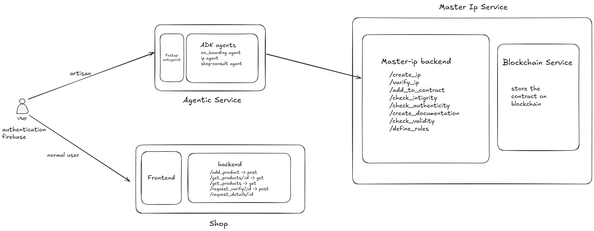

<!-- TEST COMMIT  -->

# 🎨 Kalakaari AI - Authentic Craft Verification Platform

**Empowering Indian Artisans with Blockchain-Verified Authenticity**

## 🌟 Vision
Kalakaari AI helps Indian artisans prove the authenticity of their handmade crafts using blockchain technology. Each craft gets a unique **CraftID** - a digital certificate of authenticity that buyers can verify by scanning a QR code.

## 🔧 How It Works

### For Artisans:
1. **Register Craft**: Upload craft details, photos, and artisan information
2. **AI Analysis**: Our AI validates authenticity markers and craft techniques
3. **CraftID Generation**: 
   - Create canonical JSON payload with craft data
   - Generate SHA-256 hash (digital signature)
   - Anchor on Polygon Amoy blockchain
4. **QR Code**: Receive printable QR code for the craft

### For Buyers:
1. **Scan QR Code**: Use mobile to scan craft's QR code
2. **Instant Verification**: View craft details and authenticity proof
3. **Blockchain Proof**: See immutable record on Polygon blockchain
4. **Purchase Confidence**: Buy with guaranteed authenticity

## 🏗️ Architecture



## 🚀 Services

- **`master-ip/`**: Core FastAPI service handling CraftID generation and blockchain anchoring
- **`agentic/`**: AI agents for craft authenticity validation
- **`shop/`**: Marketplace frontend (Angular) + backend for artisans and buyers
- **`contracts/`**: Polygon smart contracts for immutable proof storage

## 📱 CraftID Format

```json
{
  "craftId": "CRAFT_2024_001234",
  "artisan": {
    "name": "Ramesh Kumar",
    "location": "Rajasthan, India",
    "certification": "Government Registered"
  },
  "craft": {
    "type": "Blue Pottery",
    "technique": "Hand-thrown, Cobalt Glazed",
    "materials": ["Clay", "Cobalt Oxide", "Quartz"],
    "dimensions": "15cm x 10cm",
    "weight": "250g"
  },
  "authenticity": {
    "aiVerified": true,
    "uniqueMarkers": ["Fingerprint patterns", "Glaze texture"],
    "photos": ["front.jpg", "signature.jpg", "detail.jpg"]
  },
  "blockchain": {
    "hash": "0x7d4a5c2b1f8e9d3a6c4b7e2f1a9c8d5b3e6f2a7c4d9b1e8f5a2c6d3b7e4f1a8c",
    "blockNumber": 12345678,
    "timestamp": "2024-08-24T10:30:00Z"
  }
}
```

## 🛠️ Setup Instructions

1. **Blockchain Setup**:
   ```bash
   cd master-ip
   ./setup_blockchain.sh
   ```

2. **Backend**:
   ```bash
   cd master-ip
   pip install -r requirements.txt
   python app.py
   ```

3. **Frontend**:
   ```bash
   cd shop/shop-frontend
   # Angular setup commands
   ```

4. **AI Services**:
   ```bash
   cd agentic
   python main.py
   ```

## 🎯 Hackathon Demo Flow

1. **Artisan Registration**: Artisan uploads craft via web interface
2. **AI Validation**: System validates authenticity using computer vision
3. **CraftID Generation**: Creates unique ID and blockchain proof
4. **QR Code Creation**: Generates scannable QR code
5. **Buyer Verification**: Customer scans QR and sees authenticity proof
6. **Marketplace**: Optional - browse and purchase verified crafts

## 🌍 Impact

- **Empower Artisans**: Protect their intellectual property and craftsmanship
- **Build Trust**: Give buyers confidence in authentic handmade products
- **Preserve Heritage**: Document traditional Indian craft techniques
- **Combat Counterfeiting**: Make it impossible to fake authenticity certificates

---

*Built for Indian artisans, by developers who care about preserving cultural heritage through technology.*
